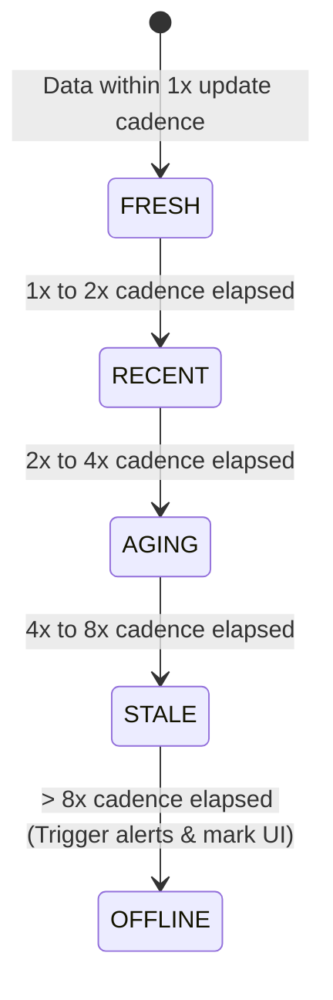

# LANDSAFE Multi-Hazard Early Warning System — Architecture Specification

**System Classification:** Academic & Non-Commercial Disaster Monitoring Platform  
**Target Environment:** Docker Compose on Linux Host  
**Official Authorities:** IMD, NDMA, NCS, GSI (System operates strictly as an advisory service)

---

## 1. System Topology & Containerized Deployment

The target architecture is deployed as a single-node Linux Docker Compose topology with dedicated worker, storage, and caching containers.

```mermaid
flowchart TD
    subgraph ExternalSources ["External Free Data Providers (Strict Priority)"]
        MOSDAC["MOSDAC (INSAT-3D/3DR QPE & IMSRA)"]
        GPM["NASA GPM IMERG (Half-Hourly Precip)"]
        OM["Open-Meteo (<10k calls/day Cross-Check)"]
        FIRMS["NASA FIRMS (Thermal Hotspots)"]
        CDSE["Copernicus CDSE (Sentinel-1 SAR / Sentinel-2)"]
        GLO30["Copernicus DEM GLO-30 / Cartosat 30m"]
        USGS["USGS FDSN Earthquake Feed"]
        COOLR["NASA COOLR / Landslide Catalog"]
    end

    subgraph IngestionLayer ["Ingestion & Normalization (APScheduler / Celery Workers)"]
        W_RAIN["Rainfall Ingestor<br>(MOSDAC -> GPM -> Open-Meteo)"]
        W_SAT["Satellite Ingestor<br>(S1 Flood/Soil, S2 NDVI/BSI)"]
        W_QUAKE["Seismic Ingestor<br>(USGS FDSN Event Ingestion)"]
        W_FIRE["Fire Ingestor<br>(NASA FIRMS Near-Real-Time)"]
        HEALTH["Source Health & Freshness Monitor"]
    end

    subgraph DataStorage ["Persistence & Object Storage"]
        POSTGIS[("PostgreSQL 16 + PostGIS 3.4<br>(Spatial & Temporal Core DB)")]
        MINIO[("MinIO Object Store<br>(Cloud-Optimized GeoTIFFs / Rasters)")]
        REDIS[("Redis 7<br>(Rate Limiting, Cache, & SSE Bus)")]
    end

    subgraph AnalyticsEngine ["Analytics & Risk Modeling Engine"]
        PHYS["Infinite-Slope Geotechnical Physics (FoS)"]
        SUSC["Susceptibility x Dynamic Trigger Model"]
        SHAP_EXP["Linear-SHAP Factor Attribution"]
        ALERT_ENG["Rule Engine: Dedupe, Cooldown, Escalation"]
    end

    subgraph APILayer ["FastAPI REST & Real-Time Push"]
        FASTAPI["FastAPI 0.115 Application Server"]
        SSE["Server-Sent Events (SSE) Alert Stream"]
    end

    subgraph ClientTier ["Canonical Frontend"]
        REACT["React 18 + Vite Web Application<br>(Interactive Maps, Freshness Badges, Drilldown)"]
        DEMO["Standalone HTML Simulator<br>(Explicitly Labeled: DEMO ONLY)"]
    end

    ExternalSources --> IngestionLayer
    IngestionLayer --> DataStorage
    DataStorage --> AnalyticsEngine
    AnalyticsEngine --> APILayer
    APILayer --> ClientTier
```



---

## 2. Data Source Priority & Ingestion Hierarchy

All data ingestion is config-driven and respects the strict India-first, zero-budget academic licensing criteria.

| Hazard / Domain | Primary Source (Priority 1) | Secondary Source (Priority 2) | Fallback / Cross-Check (Priority 3) | Spatial / Temporal Resolution | Licencing & Tier Constraints |
| :--- | :--- | :--- | :--- | :--- | :--- |
| **Precipitation** | **INSAT-3D/3DR QPE & IMSRA** (MOSDAC) | **NASA GPM IMERG** | **Open-Meteo** | ~4 km / 30-min (INSAT); ~10 km / 30-min (GPM) | Free non-commercial / research licence. Open-Meteo capped at <10,000 requests/day. |
| **SAR / Soil Moisture / Flood** | **NISAR S-SAR** (Bhoonidhi, upon approval) | **Copernicus Sentinel-1 SAR** (CDSE) | — | 10–30 m / 6–12 days | Free open data under India Space Policy 2023 & Copernicus (10k processing units/month). |
| **Vegetation / Land Cover** | **Resourcesat LISS-3/4** (Bhoonidhi, upon approval) | **Copernicus Sentinel-2** (CDSE) | — | 5–10 m / 5 days | Free open data. Cloud masking mandatory before calculating NDVI/BSI. |
| **Terrain Elevation / Slope** | **Cartosat DEM (≤30m)** (Bhoonidhi, upon approval) | **Copernicus DEM GLO-30** | — | 30 m static grid | Strict budget constraint: No Cartosat finer than 30m permitted. |
| **Seismic Events** | **USGS FDSN Web Services** | — | — | Point events (India BBox) / Latency <5 min | Free public API. **Monitoring and detection only — no earthquake predictions.** |
| **Active Fire Hotspots** | **NASA FIRMS** | — | — | 375m (VIIRS) / 1km (MODIS) / Near Real Time | Free tier with registered `MAP_KEY`. |
| **Historical Landslides** | **NASA COOLR / Global Landslide Catalog** | — | — | Historical polygon/point inventory | Free research catalog. Disclose media-reporting bias on all outputs. |
| **Basemap Tiles** | **NASA GIBS WMTS** (MODIS/VIIRS TrueColor) | **Bhuvan WMS** (`india3` layer toggle) | **OpenStreetMap / Carto** | Tile Map Service | Free to browse. Bhuvan maintained as optional toggle. |

---

## 3. Data Freshness & Provenance State Machine

Every incoming record is tagged with full provenance metadata:
- `source_id` (e.g., `MOSDAC_INSAT3D_QPE`, `NASA_GPM_IMERG`, `OPEN_METEO`)
- `product_id` & `granule_id`
- `observation_timestamp` (UTC)
- `ingestion_timestamp` (UTC)
- `processing_latency_seconds`
- `spatial_resolution_meters`
- `licence_type` (`RESEARCH_NON_COMMERCIAL` / `OPEN_GOVERNMENT_DATA`)
- `quality_flag` (`NOMINAL`, `DEGRADED`, `CLOUD_CONTAMINATED`, `ESTIMATED`)

### Freshness Classification Tiers


| Source | FRESH Threshold | RECENT Threshold | AGING Threshold | STALE Threshold | OFFLINE Threshold |
| :--- | :--- | :--- | :--- | :--- | :--- |
| **INSAT-3D/3DR QPE** | < 1 hour | 1 – 3 hours | 3 – 6 hours | 6 – 12 hours | > 12 hours |
| **NASA GPM IMERG** | < 5 hours | 5 – 8 hours | 8 – 16 hours | 16 – 24 hours | > 24 hours |
| **Open-Meteo** | < 2 hours | 2 – 4 hours | 4 – 8 hours | 8 – 16 hours | > 16 hours |
| **Sentinel-1 / 2** | < 5 days | 5 – 10 days | 10 – 15 days | 15 – 30 days | > 30 days |
| **USGS Seismicity** | < 15 mins | 15 – 60 mins | 1 – 3 hours | 3 – 6 hours | > 6 hours |

---

## 4. Database Schema Specification (PostgreSQL 16 + PostGIS)

All geospatial operations use spatial indices (`GiST`) and native PostGIS geometry types (`MultiPolygon`, `Point` in `EPSG:4326` or projected `EPSG:3857`).

```sql
-- 1. Administrative Boundaries
CREATE TABLE states (
    id SERIAL PRIMARY KEY,
    name VARCHAR(100) UNIQUE NOT NULL,
    iso_code VARCHAR(10) UNIQUE,
    geom GEOMETRY(MultiPolygon, 4326) NOT NULL
);
CREATE INDEX idx_states_geom ON states USING GIST (geom);

CREATE TABLE districts (
    id SERIAL PRIMARY KEY,
    state_id INTEGER REFERENCES states(id) ON DELETE RESTRICT,
    name VARCHAR(100) NOT NULL,
    census_code VARCHAR(20) UNIQUE,
    tier SMALLINT NOT NULL CHECK (tier IN (1, 2, 3)), -- 1: Full, 2: Screening, 3: Plains
    physiography_zone VARCHAR(50) NOT NULL,
    mean_elevation_m REAL,
    mean_slope_deg REAL,
    dominant_lithology VARCHAR(50),
    is_1893_seismic_zone SMALLINT CHECK (is_1893_seismic_zone BETWEEN 2 AND 5),
    geom GEOMETRY(MultiPolygon, 4326) NOT NULL,
    centroid GEOMETRY(Point, 4326) NOT NULL
);
CREATE INDEX idx_districts_geom ON districts USING GIST (geom);
CREATE INDEX idx_districts_tier ON districts(tier);

-- 2. Source Provenance & Health Registry
CREATE TABLE data_sources (
    id VARCHAR(50) PRIMARY KEY, -- e.g., 'MOSDAC_INSAT3D_QPE'
    name VARCHAR(150) NOT NULL,
    provider VARCHAR(100) NOT NULL, -- e.g., 'ISRO/MOSDAC'
    cadence_minutes INTEGER NOT NULL,
    licence VARCHAR(100) NOT NULL,
    api_endpoint VARCHAR(255),
    is_active BOOLEAN DEFAULT TRUE
);

CREATE TABLE source_health (
    source_id VARCHAR(50) PRIMARY KEY REFERENCES data_sources(id),
    status VARCHAR(20) NOT NULL CHECK (status IN ('FRESH', 'RECENT', 'AGING', 'STALE', 'OFFLINE')),
    last_successful_fetch TIMESTAMPTZ,
    last_attempt_status VARCHAR(50),
    consecutive_failures INTEGER DEFAULT 0,
    average_latency_ms REAL,
    updated_at TIMESTAMPTZ DEFAULT NOW()
);

-- 3. Weather & Meteorological Observations
CREATE TABLE weather_observations (
    id BIGSERIAL PRIMARY KEY,
    district_id INTEGER REFERENCES districts(id) ON DELETE CASCADE,
    source_id VARCHAR(50) REFERENCES data_sources(id),
    observation_time TIMESTAMPTZ NOT NULL,
    ingestion_time TIMESTAMPTZ DEFAULT NOW(),
    temperature_c REAL,
    relative_humidity_pct REAL,
    wind_speed_kmh REAL,
    rainfall_1h_mm REAL,
    rainfall_24h_mm REAL,
    rainfall_7d_cumulative_mm REAL,
    antecedent_saturation_index REAL,
    quality_flag VARCHAR(20) DEFAULT 'NOMINAL',
    is_forecast BOOLEAN DEFAULT FALSE,
    CONSTRAINT uq_district_weather_time UNIQUE (district_id, source_id, observation_time, is_forecast)
);
CREATE INDEX idx_weather_district_time ON weather_observations(district_id, observation_time DESC);

-- 4. Satellite Environmental Observations
CREATE TABLE satellite_observations (
    id BIGSERIAL PRIMARY KEY,
    district_id INTEGER REFERENCES districts(id) ON DELETE CASCADE,
    source_id VARCHAR(50) REFERENCES data_sources(id),
    granule_id VARCHAR(150) NOT NULL,
    capture_time TIMESTAMPTZ NOT NULL,
    snow_cover_fraction REAL,
    snowmelt_mm_day REAL,
    bare_soil_index REAL,
    ndvi REAL,
    sar_inundation_km2 REAL,
    cloud_cover_pct REAL,
    raster_s3_path VARCHAR(255),
    quality_flag VARCHAR(20) DEFAULT 'NOMINAL'
);
CREATE INDEX idx_satellite_district_time ON satellite_observations(district_id, capture_time DESC);

-- 5. Seismic & Natural Hazard Events
CREATE TABLE seismic_events (
    id VARCHAR(50) PRIMARY KEY, -- USGS Event ID
    magnitude REAL NOT NULL,
    depth_km REAL NOT NULL,
    epicenter GEOMETRY(Point, 4326) NOT NULL,
    event_time TIMESTAMPTZ NOT NULL,
    nearest_district_id INTEGER REFERENCES districts(id),
    distance_to_district_km REAL,
    pga_estimate_g REAL,
    source VARCHAR(50) DEFAULT 'USGS_FDSN'
);
CREATE INDEX idx_seismic_geom ON seismic_events USING GIST (epicenter);

-- 6. Hazard Assessments & Alerts
CREATE TABLE risk_assessments (
    id BIGSERIAL PRIMARY KEY,
    district_id INTEGER REFERENCES districts(id) ON DELETE CASCADE,
    calculated_at TIMESTAMPTZ DEFAULT NOW(),
    model_version VARCHAR(50) NOT NULL,
    factor_of_safety REAL,
    susceptibility_score REAL,
    trigger_score REAL,
    composite_hazard_index REAL NOT NULL,
    hazard_level VARCHAR(20) NOT NULL CHECK (hazard_level IN ('LOW', 'MODERATE', 'HIGH', 'SEVERE', 'EXTREME')),
    model_uncertainty REAL,
    linear_shap_factors JSONB,
    glof_risk_level VARCHAR(20),
    flash_flood_level VARCHAR(20),
    input_quality_flag VARCHAR(20)
);
CREATE INDEX idx_risk_district_time ON risk_assessments(district_id, calculated_at DESC);

CREATE TABLE alerts (
    id BIGSERIAL PRIMARY KEY,
    district_id INTEGER REFERENCES districts(id) ON DELETE CASCADE,
    hazard_type VARCHAR(50) NOT NULL, -- 'Landslide', 'Flash Flood', 'GLOF', 'Thermal Anomaly'
    severity VARCHAR(20) NOT NULL CHECK (severity IN ('INFO', 'WATCH', 'WARNING', 'CRITICAL')),
    title VARCHAR(200) NOT NULL,
    message_en TEXT NOT NULL,
    message_hi TEXT,
    message_bn TEXT,
    message_as TEXT,
    message_ml TEXT,
    cap_identifier VARCHAR(100) UNIQUE NOT NULL,
    is_active BOOLEAN DEFAULT TRUE,
    issued_at TIMESTAMPTZ DEFAULT NOW(),
    expires_at TIMESTAMPTZ NOT NULL,
    cooldown_until TIMESTAMPTZ NOT NULL
);
CREATE INDEX idx_alerts_active ON alerts(is_active, severity);
```

---

## 5. Hazard Engine Analytical Formulation

### A. Infinite-Slope Geotechnical Model ($FoS$)
$$\text{FoS} = \frac{c' + c_r + (\gamma \cdot z - \gamma_w \cdot h_w)\cos^2\theta \cdot \tan\phi'}{\gamma \cdot z \cdot \sin\theta\cos\theta + k_h \cdot \gamma \cdot z \cdot \cos\theta}$$
- $c'$: Effective soil cohesion (derived from GSI lithology).
- $c_r$: Root reinforcement cohesion (scaled by NDVI vegetation density).
- $\gamma$: Soil bulk unit weight ($18.5 \text{ kN/m}^3$).
- $\gamma_w$: Pore fluid unit weight ($9.81 \text{ kN/m}^3$).
- $z$: Regolith soil depth (meters).
- $h_w$: Transient water table height from 10-day Antecedent Saturation Index ($h_w = z \cdot \text{ASI}$).
- $\theta$: Local terrain slope angle (degrees from Cartosat/GLO-30 DEM).
- $\phi'$: Effective internal friction angle ($28^\circ - 36^\circ$).
- $k_h$: Pseudo-static horizontal seismic coefficient ($k_h = 0.5 \cdot \text{PGA}$, indexed via IS 1893 seismic zones).

### B. Susceptibility $\times$ Dynamic Trigger Interaction
$$\text{Hazard Index } (H) = S_{\text{terrain}} \times T_{\text{dynamic}}$$
$$S_{\text{terrain}} = w_{\text{slope}} f(\theta) + w_{\text{litho}} f(\text{Litho}) + w_{\text{seismic}} f(\text{Zone}) + w_{\text{road}} f(D_{\text{road}})$$
$$T_{\text{dynamic}} = \alpha \cdot \frac{R_{24h}}{R_{\text{thresh}}} + \beta \cdot \text{ASI}_{10d} + \gamma \cdot \frac{M_{\text{snow}}}{M_{\text{thresh}}}$$
- Prevents spurious alerts: steep dry cliffs ($T \approx 0$) and saturated flat plains ($S \approx 0$) both yield $H \approx 0$.
- **Disagreement Metric:** The spread between $(1 - \text{FoS}/1.5)$ and $H$ is computed as real-time **Model Uncertainty**.

---

## 6. Real-Time Alert Engine (Deduplication, Cooldown, Escalation)

1. **Threshold Assessment**: Rules evaluate physical breaches ($FoS < 1.0$, $H > 0.45$, $R_{24h} > \text{threshold}$).
2. **Deduplication & Cooldown**: Active alerts for the same district and hazard type enter a **4-hour cooldown** to prevent alert spamming.
3. **Escalation**: If risk level jumps from `HIGH` to `CRITICAL` during cooldown, the alert escalates immediately with an updated CAP identifier.
4. **Expiry**: Alerts auto-expire after 12 hours unless renewed by consecutive trigger readings.
5. **Real-time Push**: Broadcast via Server-Sent Events (`/api/v1/events`) to the React frontend.

---

## 7. Milestone Roadmap

```
M0: Baseline audit & fake-data quarantine (pytest test suite)
M1: PostgreSQL 16 + PostGIS 3.4 database migration (GeoAlchemy2 + Alembic)
M2: Common ingestion framework (APScheduler/Celery, retry, backoff, health tracking)
M3: Weather ingestion (MOSDAC INSAT-3D/3DR -> NASA GPM -> Open-Meteo)
M4: Satellite & Environmental ingestion (FIRMS -> Sentinel-1 SAR -> Sentinel-2 NDVI)
M5: Seismic ingestion (USGS FDSN event tracking & IS 1893 spatial join)
M6: Physics & Susceptibility hazard engine (Infinite-Slope FoS + Linear-SHAP)
M7: Rule-based alerting & real-time SSE stream
M8: Secondary hazards (GLOF, flash flood, fire, thermal anomaly)
M9: Canonical React frontend integration (State > District drilldown, freshness badges)
M10: Automated disaster advisory reports (PDF/JSON with data provenance)
M11: Security & rate-limiting audit (JWT auth on write routes, CORS restrictions)
M12: Full regression testing & deployment verification
```
